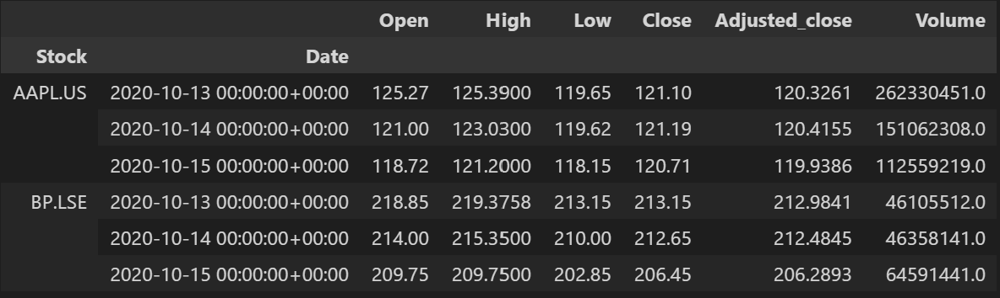
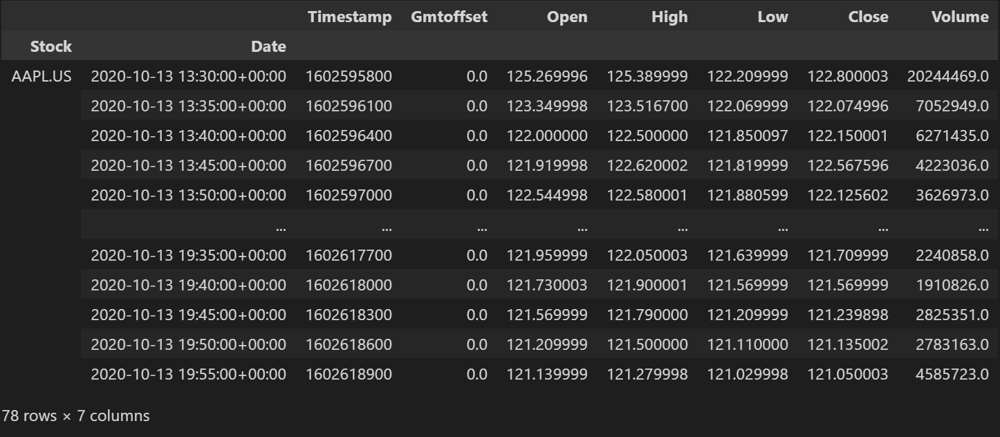
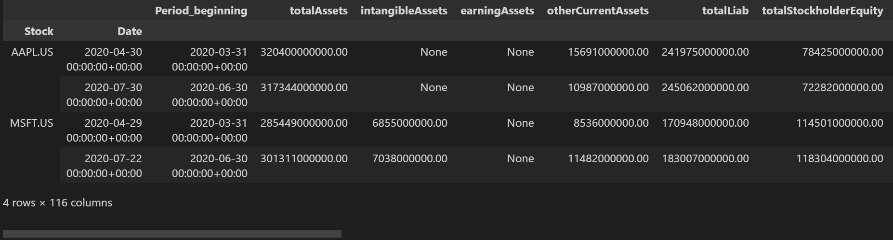
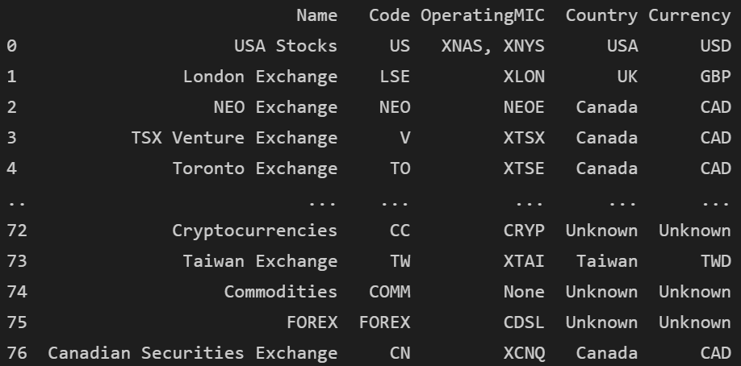
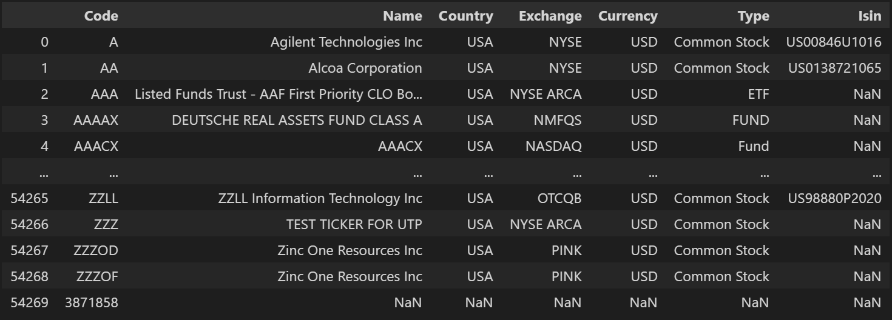
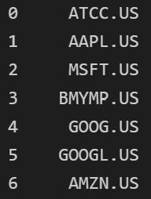
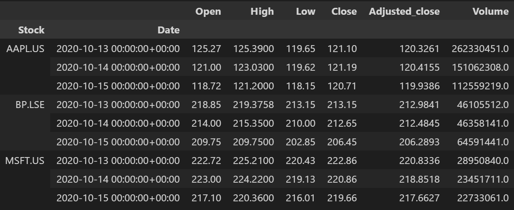
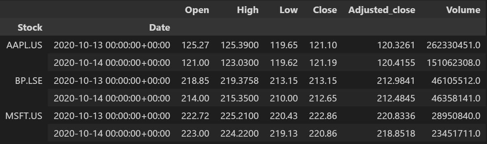
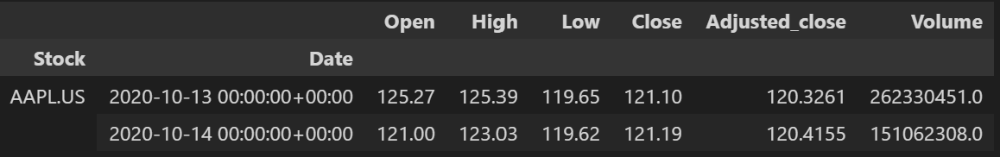

# Description 
After working with data from [eodhistoricaldata.com](https://eodhistoricaldata.com) for a while I made this to simplify fetching and aggregating from their different endpoints and returning it in a consistent format.

# Usage
### Set up
- Have python and pandas installed (I'm using Python 3.8.10 and pandas 1.3.1)
- Download the `EOD_api.py` file to your working directory

### Market data - daily and intraday
You can download data for different stocks across different exchanges by just providing a list of tickers
```python
import EOD_api as eod
import os
token = os.environ['EOD_TOKEN'] # Place your token here, i.e. token = '12ab3cd5efgh45.12345678'
eod.ohlcv( ['AAPL.US','BP.LSE'], token, '2020-10-13', '2020-10-15').retrieve_data()
```


```python
eod.ohlcv_intraday( ['AAPL.US'], token, '2020-10-13', '2020-10-14',intraday_frec='5m').retrieve_data()
```


### Fundamental data
The Income Statement, Balance Sheet, and Cash Flow data all in one pandas dataframe

```python
eod.fundamental( ['AAPL.US','MSFT.US'], token, '2020-04-01', '2020-08-01').retrieve_data()
```


### Extra
Some extra functions and methods to make data exploration easier from the start
<details>
<summary> Show </summary>

<br/>Get the list of available exchanges:  
  
```python
eod.get_exchange_list( token )
```
  


<br/>Get info on all the available tickers from a exchange:

```python
eod.get_all_tickers_exchange('US',token) 
``` 



<br/>Find tickers by marketcap:

```python
eod.stock_screener( 7, token, 'US', initial_offset = 0, mincap = None, maxcap = None)['code']
``` 

  
  
<br/>Some methods to make it easier to add or remove data incrementally instead of downloading all the data from the data provider at every step during data exploration:
   
```python
data = eod.ohlcv( ['AAPL.US','BP.LSE'], token, '2020-10-13', '2020-10-15')
data.retrieve_data()
``` 


```python
data.add_tickers(['MSFT.US']).retrieve_data()
```


```python
data.truncate_dates('2020-10-13','2020-10-14').retrieve_data()
```


```python
data.remove_tickers(['MSFT.US','BP.LSE']).retrieve_data()
```

 </details>
 
 # Syntax
<details>
<summary> Show </summary>
  
 ## Class `ohlcv( tickers, token, start, end):`
 Downloads ohlcv data to a pandas dataframe
 
 ### Arguments
   - `tickers` : List of tickers to download
   - `token`   : String with your key from the data provider
   - `start`   : String with the initial date from which to download data
   - `end`     : String with the final date from which to download data
 
### Methods 
 - `retrieve_data()` : Return the dataframe with the data
 - `add_tickers( tickers)` : Download more tickers to the dataframe
    - `tickers`: List of tickers to download
 - `remove_tickers( tickers)` : Remove tickers
    - `tickers`: List of tickers to remove
 - `truncate_dates( start, end)` : Remove dates
    - `start`: String with the new initial date
    - `end`  : String with the new final date
 
## Class `ohlcv_intraday( tickers, token, start, end, intraday_frec='5m'):`
Downloads intraday data to a pandas dataframe
 
### Arguments (same as ohlcv)    
   - `intraday_frec`: Frecuency of intraday data. '5m' and '1m'. Check the data provider for availability of data.
 
### Methods (Same as ohlcv)
 
## Class `fundamental( tickers, token, start, end):`
Downloads fundamental data to a pandas dataframe. The Income Statement, Balance Sheet, and Cash Flow data is aggregated into one dataframe. If any columns have duplicated names only one is kept.
 
### Arguments (same as ohlcv)    
 
### Methods (Same as ohlcv)
  
## Function `get_exchange_list( token):`
Returns a list of the available exchanges and some more info
 
## Function `get_all_tickers_exchange( exchange, token):`
Returns a list of the available tickers for a exchange and some more info  

## Function `stock_screener( n_stocks, token, exchange, initial_offset = 0, mincap = None, maxcap = None):`
Finds first n stocks in exchange by marketcap

### Arguments 
   - `n_stocks`: Int. Number of stocks to find
   - `exchange`: String. Chosen exchange
   - `initial_offset` : Number of stocks to skip
   - `mincap`     :Minimum market capitalization
   - `maxcap`     :Maximum market capitalization  
</details>


# More types of data
I don't plan to maintain this.<br/>
However, I created a `EODdata` class inside the `EOD_api.py` that you can subclass to add more types of data. This way you might download all of your data from [eodhistoricaldata.com](https://eodhistoricaldata.com) in a streamlined way.
You can check all of the data types they offer in their website. For example you could include options, bonds, live data, financial news, insider trading, etc. <br/>
If you found any of this useful I would appreciate feedback.
